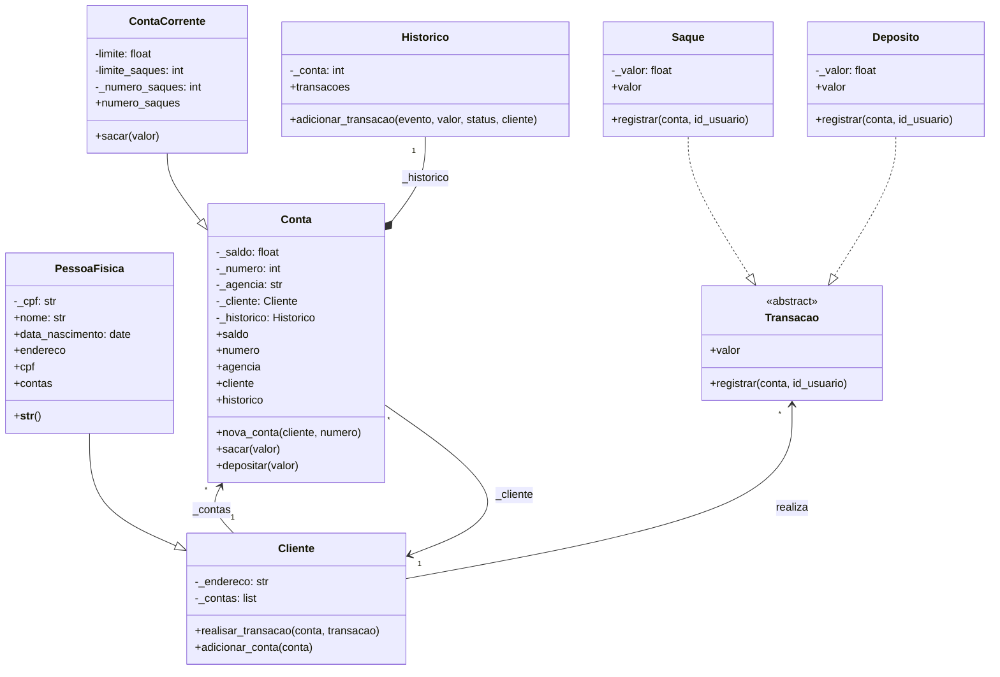

<h1>
  <table>
    <tr>
      <td>
        
      </td>
      <td width="700">
        <p>Luizalabs - Back-end com Python</p>
      </td>
    </tr>
  </table>
</h1>

[](https://docs.python.org/3.12/)
[](https://web.dio.me/track/luizalabs-back-end-com-python)


```mermaid
---
config:
  theme: redux
  layout: elk
---
flowchart LR
    A(["Inicio"]) --> n111["While True:"]
    B{"Menu_Principal"} --> C["[c] Cadastro"] & D["[a] Acessar/Criar Conta"] & n1["[d] Depositar"] & n2["[s] Sacar"] & n3["[e] Extrato"] & n5["[l] listar informações"] & n103@{ label: "<span style=\"padding-left:\">[q] Sair</span>" }
    C --> n72["Menu_Bloqueado"]
    n6["criar_usuario()"] --> n7["Valida data"]
    n7 --> n39["Data valida?"]
    n8["validar_cpf()"] --> n35["CPF é valido?"]
    n9["buscar_usuario()"] --> n43["Usuario encontrado?"]
    D --> n11["Menu_Secundario"]
    n11 --> n12["[s] fazer login"] & n13["[n] criar conta"]
    n15["validar_cpf()"] --> n47["CPF é valido?"]
    n16["buscar_usuario()"] --> n51["Usuario encontrado?"]
    n17["return contas_para_texto()"] --> n18["input(digite o numero da conta que quer acessar:)"]
    n18 --> n83["valida num"]
    n13 --> n87@{ label: "<span style=\"padding-left:\">Menu_Bloqueado</span>" }
    n12 --> n78["Menu_Bloqueado"]
    n20["criar_conta()"] --> n21["validar_cpf()"]
    n21 --> n55@{ label: "<span style=\"padding-left:\">CPF é valido?</span>" }
    n22["buscar_usuario()"] --> n59@{ label: "<span style=\"padding-left:\">Usuario encontrado?</span>" }
    n1 --> n24["status[1] is not None"]
    n24 --> n91@{ label: "<span style=\"padding-left:\"><span style=\"padding-left:\">Menu_Bloqueado</span></span>" } & n92@{ label: "<span style=\"padding-left:\">return Nenhuma conta acessada.</span>" }
    n25["input(digite o valor:)"] --> n63["Valor valido?"]
    n26["deposito()"] --> n27["return saldo"]
    n2 --> n28["status[1] is not None"]
    n28 --> n96@{ label: "<span style=\"padding-left:\"><span style=\"padding-left:\"><span style=\"padding-left:\">Menu_Bloqueado</span></span></span>" } & n97@{ label: "<span style=\"padding-left:\"><span style=\"padding-left:\">return Nenhuma conta acessada.</span></span>" }
    n29["input(digite o valor:)"] --> n67["Valor valido?"]
    n30["saque()"] --> n31["return saldo"]
    n3 --> n32["status[1] is not None"]
    n32 --> n101@{ label: "<span style=\"padding-left:\"><span style=\"padding-left:\"><span style=\"padding-left:\"><span style=\"padding-left:\">Menu_Bloqueado</span></span></span></span>" } & n102@{ label: "<span style=\"padding-left:\"><span style=\"padding-left:\"><span style=\"padding-left:\">return Nenhuma conta acessada.</span></span></span>" }
    n35 --> n36["Sim"] & n37["Não"]
    n36 --> n9
    n37 --> n38["return None, mensagem"]
    n39 --> n40["Sim"] & n41["Não"]
    n40 --> n8
    n41 --> n42@{ label: "<span style=\"padding-left:\">return None, mensagem</span>" }
    n43 --> n44["Sim"] & n45["Não"]
    n44 --> n10["return clientes[]"]
    n45 --> n46@{ label: "<span style=\"padding-left:\">return None, mensagem</span>" }
    n47 --> n48["Sim"] & n49["Não"]
    n48 --> n16
    n49 --> n50@{ label: "<span style=\"padding-left:\">return None, mensagem</span>" }
    n51 --> n52["Sim"] & n53["Não"]
    n52 --> n17
    n53 --> n54@{ label: "<span style=\"padding-left:\">return None, mensagem</span>" }
    n55 --> n56@{ label: "<span style=\"padding-left:\">Sim</span>" } & n57@{ label: "<span style=\"padding-left:\">Não</span>" }
    n56 --> n22
    n57 --> n58@{ label: "<span style=\"padding-left:\"><span style=\"padding-left:\">return None, mensagem</span></span>" }
    n59 --> n60@{ label: "<span style=\"padding-left:\">Sim</span>" } & n61@{ label: "<span style=\"padding-left:\">Não</span>" }
    n60 --> n23["return clientes[]"]
    n61 --> n62@{ label: "<span style=\"padding-left:\"><span style=\"padding-left:\">return None, mensagem</span></span>" }
    n63 --> n64["Sim"] & n65["Não"]
    n64 --> n26
    n65 --> n66["return None, mensagem"]
    n67 --> n68["Sim"] & n69["Não"]
    n68 --> n30
    n69 --> n70@{ label: "<span style=\"padding-left:\">return None, mensagem</span>" }
    n33["mostrar_extrato()"] --> n71["return Conta.Historico()"]
    n72 --> n73["try"] & n74["except: [q] Sair, Cancelar operação"]
    n73 --> n75["Input: nome, data_nascimento, cpf, rua, numero, bairro, cidade, estado"]
    n75 --> n6
    n74 --> n76["return None, mensagem"]
    n78 --> n79["try"] & n80["except: [q] Sair, Cancelar operação"]
    n79 --> n81["acessar_conta()"]
    n80 --> n82@{ label: "<span style=\"padding-left:\">return None, mensagem</span>" }
    n81 --> n15
    n83 --> n85@{ label: "<span style=\"padding-left:\">return status[]</span>" } & n86@{ label: "<span style=\"padding-left:\">return None, mensagem</span>" }
    n87 --> n88["try"] & n89@{ label: "<span style=\"padding-left:\">except: [q] Sair, Cancelar operação</span>" }
    n89 --> n90@{ label: "<span style=\"padding-left:\"><span style=\"padding-left:\">return None, mensagem</span></span>" }
    n88 --> n20
    n91 --> n93["try"] & n94@{ label: "<span style=\"padding-left:\"><span style=\"padding-left:\">except: [q] Sair, Cancelar operação</span></span>" }
    n93 --> n25
    n94 --> n95@{ label: "<span style=\"padding-left:\"><span style=\"padding-left:\"><span style=\"padding-left:\">return None, mensagem</span></span></span>" }
    n96 --> n98["try"] & n99@{ label: "<span style=\"padding-left:\"><span style=\"padding-left:\"><span style=\"padding-left:\">except: [q] Sair, Cancelar operação</span></span></span>" }
    n99 --> n100@{ label: "<span style=\"padding-left:\"><span style=\"padding-left:\"><span style=\"padding-left:\"><span style=\"padding-left:\">return None, mensagem</span></span></span></span>" }
    n98 --> n29
    n101 --> n33
    n103 --> n104["Limpa o Terminal"]
    n104 --> n34["break"]
    n5 --> n105@{ label: "<span style=\"padding-left:\">status[1] is not None</span>" }
    n105 --> n106@{ label: "<span style=\"padding-left:\"><span style=\"padding-left:\"><span style=\"padding-left:\"><span style=\"padding-left:\"><span style=\"padding-left:\">Menu_Bloqueado</span></span></span></span></span>" } & n107@{ label: "<span style=\"padding-left:\"><span style=\"padding-left:\"><span style=\"padding-left:\"><span style=\"padding-left:\">return Nenhuma conta acessada.</span></span></span></span>" }
    n106 --> n109["ContaIterador"]
    n109 --> n108["contas_usuario_para_texto()"]
    n108 --> n110["return clientes[id]"]
    n111 --> B

    C@{ shape: rect}
    n1@{ shape: rect}
    n103@{ shape: rect}
    n6@{ shape: lean-l}
    n7@{ shape: rect}
    n39@{ shape: diam}
    n8@{ shape: lean-l}
    n35@{ shape: diam}
    n9@{ shape: lean-l}
    n43@{ shape: diam}
    n11@{ shape: diam}
    n15@{ shape: lean-l}
    n47@{ shape: diam}
    n16@{ shape: lean-l}
    n51@{ shape: diam}
    n87@{ shape: rect}
    n78@{ shape: rect}
    n20@{ shape: lean-l}
    n21@{ shape: lean-l}
    n55@{ shape: diam}
    n22@{ shape: lean-l}
    n59@{ shape: diam}
    n91@{ shape: rect}
    n92@{ shape: lean-r}
    n25@{ shape: lean-l}
    n63@{ shape: diam}
    n26@{ shape: lean-l}
    n27@{ shape: lean-r}
    n96@{ shape: rect}
    n97@{ shape: lean-r}
    n29@{ shape: lean-l}
    n67@{ shape: diam}
    n30@{ shape: lean-l}
    n31@{ shape: lean-r}
    n101@{ shape: rect}
    n102@{ shape: lean-r}
    n38@{ shape: lean-r}
    n42@{ shape: lean-r}
    n10@{ shape: lean-r}
    n46@{ shape: lean-r}
    n50@{ shape: lean-r}
    n54@{ shape: lean-r}
    n56@{ shape: rect}
    n57@{ shape: rect}
    n58@{ shape: lean-r}
    n60@{ shape: rect}
    n61@{ shape: rect}
    n23@{ shape: lean-r}
    n62@{ shape: lean-r}
    n66@{ shape: lean-r}
    n70@{ shape: lean-r}
    n33@{ shape: lean-l}
    n71@{ shape: lean-r}
    n75@{ shape: lean-l}
    n76@{ shape: lean-r}
    n79@{ shape: rect}
    n80@{ shape: rect}
    n81@{ shape: lean-l}
    n82@{ shape: lean-r}
    n85@{ shape: lean-r}
    n86@{ shape: lean-r}
    n89@{ shape: rect}
    n90@{ shape: lean-r}
    n94@{ shape: rect}
    n95@{ shape: lean-r}
    n99@{ shape: rect}
    n100@{ shape: lean-r}
    n105@{ shape: rect}
    n106@{ shape: rect}
    n107@{ shape: lean-r}
    n109@{ shape: lean-r}
    n108@{ shape: lean-l}
```

## Servicos.py

---
## Imagens do Sistema

| Usuário não logado | Usuário logado |
|:--:|:--:|
|  |  |
|  |  |

---

# Instalação e Execução

### Requisitos
- Python 3.12+
- Ambiente de terminal (Linux, macOS ou Windows)

### Passos
```bash
git clone https://github.com/Junior010101/Projeto02_Dio.LuisaLabs
cd Projeto02_Dio.LuisaLabs
python main.py
```

## Estrutura do Projeto

```
root/
│
├─ cache/                # Gerado em tempo de execução (ignorado pelo git)
│   └─ log.txt           # Registro das operações
│
├─ python/
│   ├─ funcoes.py        # Regras de negócio: cadastro, contas, saques, depósitos, extratos
│   ├─ servicos.py       # Modelos de domínio: Cliente, Conta, Transações, Histórico
│   └─ utils.py          # Validações, menu, busca de usuários, utilitários
│
├─ main.py               # Loop principal e interface de terminal
├─ .gitignore
├─ README.md
└─ pyproject.toml
```

---

## Regras de Negócio

### Usuários
- CPF único por usuário
- Data de nascimento validada (DD/MM/AAAA)
- Um usuário pode possuir múltiplas contas

### Contas
- Conta vinculada a um usuário já cadastrado
- Número da conta gerado automaticamente
- Um usuario pode criar varias contas

## Operações

**Depósito**
- Apenas valores positivos
- Operação registrada no histórico

**Saque**
- Valor limitado por saque
- Número máximo de saques
- Recusado se o saldo for insuficiente

**Extrato**
- Lista todas as operações realizadas
- Exibe saldo atual da conta

### Observações
- Os dados de usuários e contas são mantidos em memória durante a execução
- O histórico de transações é persistido em arquivo (cache/log.txt)

---
**Desenvolvido por [Junior010101](https://github.com/Junior010101)**
