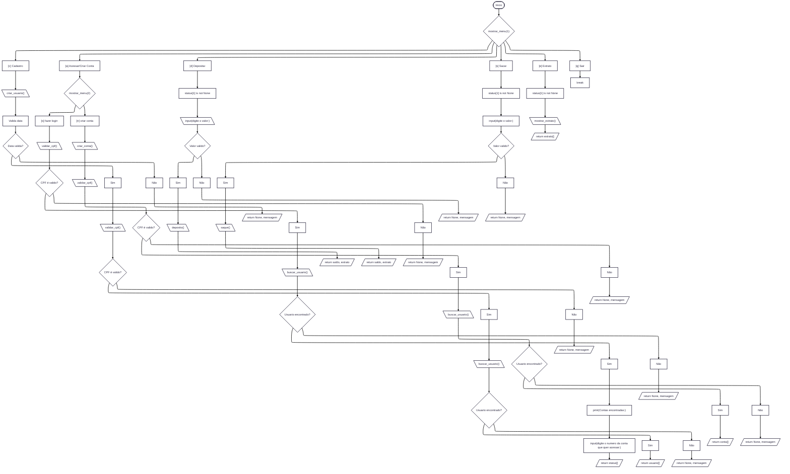

<h1>
  <table>
    <tr>
      <td>
        
      </td>
      <td width="700">
        <p>Luizalabs - Back-end com Python</p>
      </td>
    </tr>
  </table>
</h1>

[](https://docs.python.org/3.12/)
[](https://web.dio.me/track/luizalabs-back-end-com-python)



## Instalação e Execução

### Requisitos
- Python 3.12+
- Ambiente de terminal (Linux, macOS ou Windows)

### Passos
```bash
git clone https://github.com/Junior010101/Projeto01_Dio.LuisaLabs
cd Projeto01_Dio.LuisaLabs
python main.py
```

## Estrutura do Projeto

```
root/
  python/
    funcoes.py       # Depósitos, saques, extratos, cadastro, criação de contas.
    utils.py         # listagem, validação, busca de usuários, Validação de CPF.
  main.py            # Loop principal e menu.
```

---

## Regras de Negócio

### Usuários
- CPF único por usuário
- Data de nascimento validada (DD/MM/AAAA)
- Usuário pode ter múltiplas contas

### Contas
- Conta vinculada a um usuário já cadastrado
- Número da conta gerado automaticamente
- Um usuario pode criar varias contas

## Operações

**Depósito**
- Apenas valores positivos
- Registrado no extrato

**Saque**
- Limite configurado no código
- Número máximo de saques
- Recusado se o saldo for insuficiente

**Extrato**
- Lista todas as operações
- Mostra saldo atual

---
**Desenvolvido por [Junior010101](https://github.com/Junior010101)**
